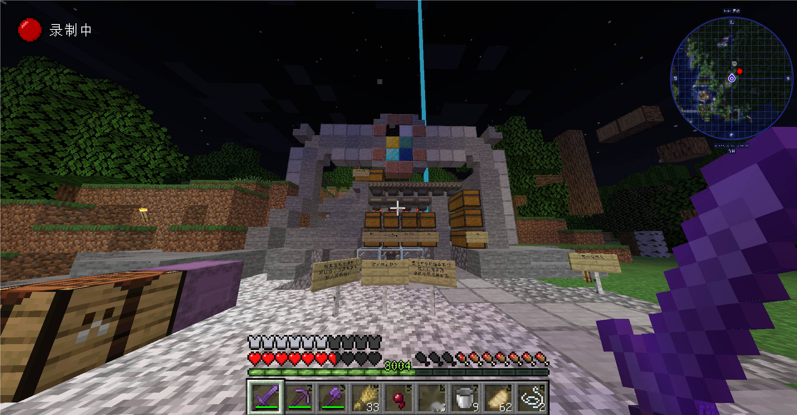
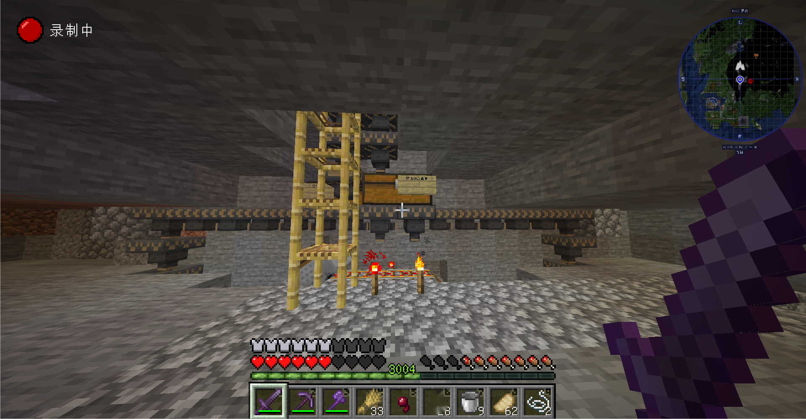
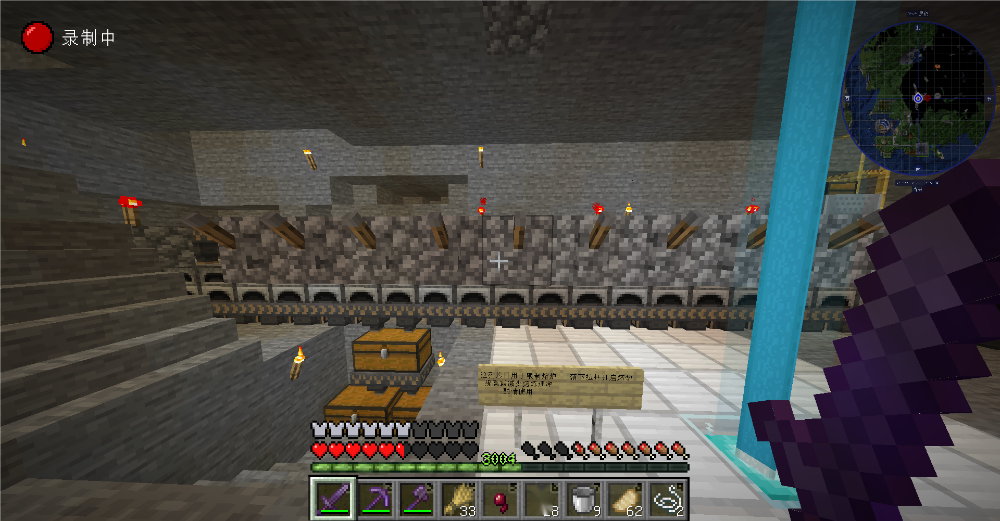

import Artplayer from '@site/src/components/ArtPlayer';
import vedio from './media/auto-furnace-guide-vedio.mp4'

# 自动熔炉

大型自动熔炉  
……  
总之是个炉子  

## 建造者  
yin

## 位置  
### 坐标  
世界: 主世界 x: 577 y: 88 z: 31  
### 传送点  
暂无

## 使用方法  

:::tip  
由于服主智商问题，视频暂无法播放，请点击 [此链接](media/auto-furnace-guide-vedio.mp4) 查看或下载  
运行开发服务器播放器正常但构建后只剩div(坐等大佬救)  
:::  

使用此装置时请仔细查看每个告示牌  
<!-- TODO上传并更改视频地址 -->

    <Artplayer
        option={{
            url: vedio,
        }}
        style={{
            'aspect-ratio': '16/9',
            width: '100%',
        }}
        getInstance={(art) => console.info(art)}
    />

## 图集  

  
  
  

