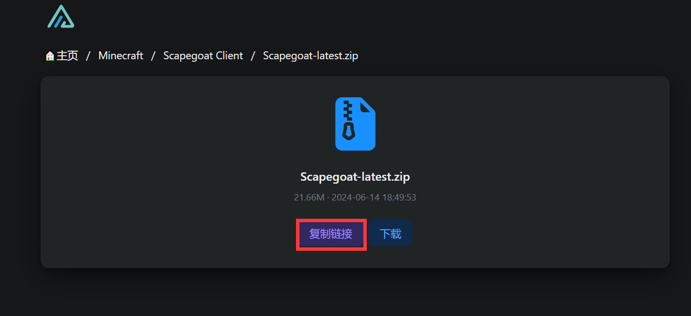

import Tabs from '@theme/Tabs';
import TabItem from '@theme/TabItem';

# 更新整合包  

<Tabs>
    <TabItem value="HMCL" label="HMCL">

:::warning  
请务必保持整合包最新否则可能无法加入服务器
:::  
:::info  
在[**这里**](https://pan.jerry.ink/public/Minecraft/Scapegoat%20Client/Scapegoat-latest.zip)下载最新的整合包  
:::  

  
  
  
  
  

    </TabItem>{/*hcml end*/}

    <TabItem value="PCL" label='PCL'>

目前没人用, 有人用了再写\[坏笑\]

    </TabItem>{/*pcl end*/}
    
    <TabItem value="FCL" label="FCL">

用浏览器打开[整合包下载页面](https://pan.jerry.ink/public/Minecraft/Scapegoat%20Client/Scapegoat-latest.zip)并点击「复制链接」  
  

先选择Scapegoat整合包对应的版本(已选择请跳过)  
  
  
更新  
  
  
  
在这个框中粘贴你复制的url  
  
  

    </TabItem>
</Tabs>