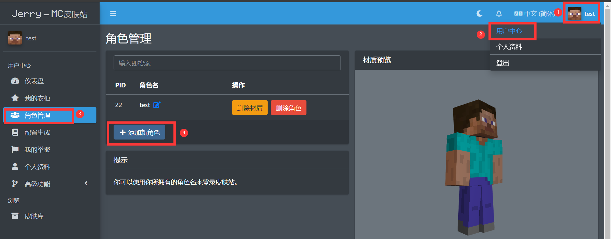
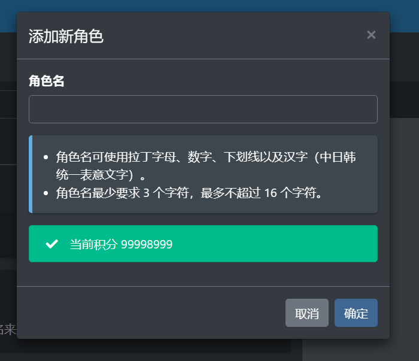

# 添加角色  
**各类皮肤 mod，外置登录等都依赖于角色名。它们通过角色名识别玩家身份，所以必须先创建角色才能在游戏同加载皮肤或使用外置登录**  
:::warning  
创建角色前，请务必确保您已经通过邮箱验证，验证邮件可能会出现在垃圾箱中，或者将邮件服务器添加白名再试（mail.jerry.ink）
若您始终无法收到邮件，请与管理员联系
:::
:::tip  
创建角色会消耗一定积分，具体请查看[**「积分系统」**](../intergrating-system)
:::  
在[「用户中心」](https://account.mc.jerry.ink/user)->[**「角色管理」**](https://account.mc.jerry.ink/user/player)页面查看和编辑您的角色  
  
:::tip 角色名命名规则  
使用大小写字母、中日韩文、数字、下划线命名  
**强调：不可包含空格**  
:::  
  

如果您需要同步正版角色，请前往[**「用户中心」**](https://account.mc.jerry.ink/user)页面绑定正版，绑定后您可以获得一定积分
:::caution  
由于一定原因，该功能未经充分测试，如在绑定过程中出现错误请务必与站长联系
:::  
