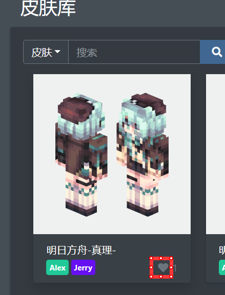
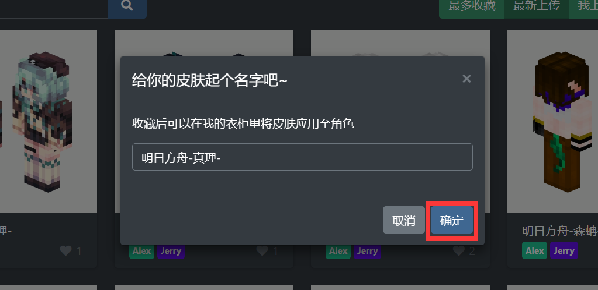
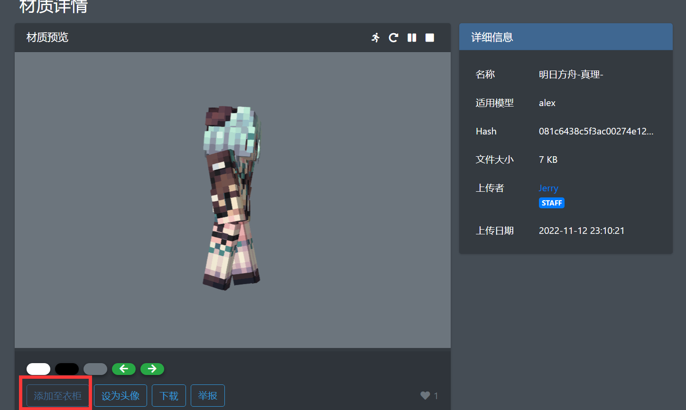
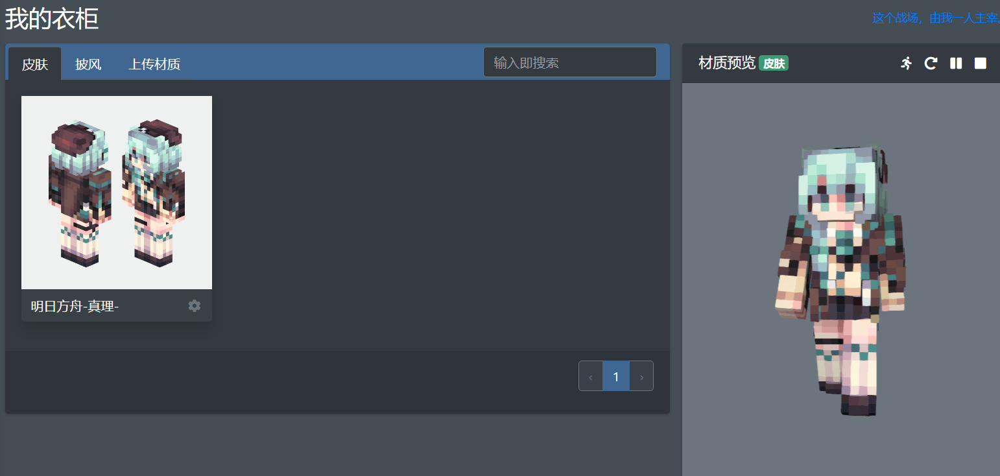
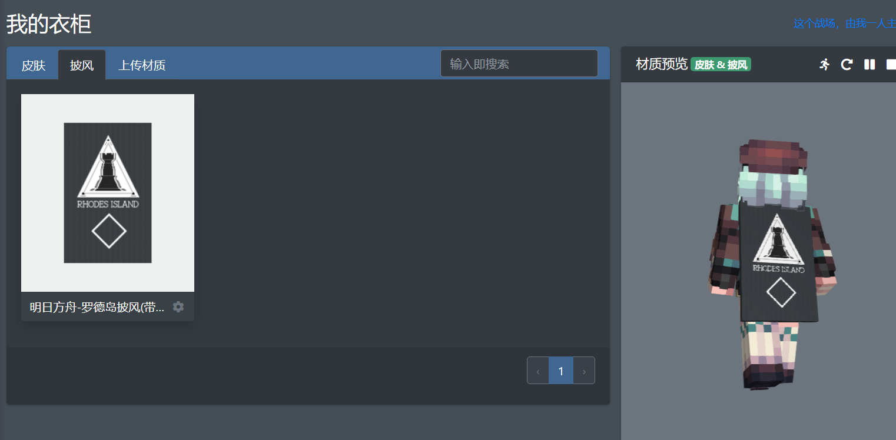
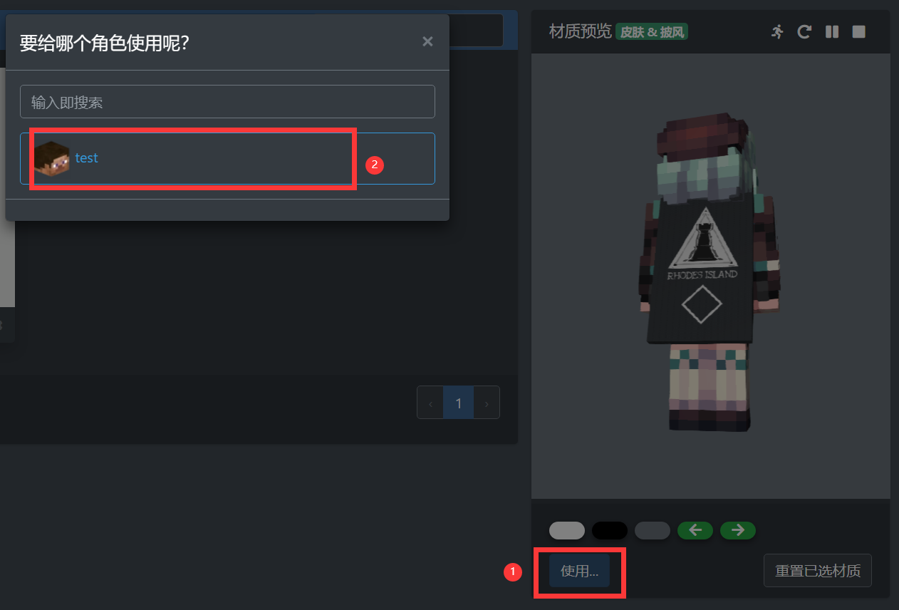

import Tabs from '@theme/Tabs';
import TabItem from '@theme/TabItem';

# 设置材质

在应用材质到角色前，首先要在衣柜中添加材质。可以在皮肤库中选择并添加到衣柜，或自行上传

## 上传材质  
:::tip
此操作将有积分变动，具体规则请参阅[「**积分系统**」](../intergrating-system)
:::

前往[「皮肤库」](https://skin.mc.jerry.ink/skinlib)->[**「上传新皮肤」**](https://skin.mc.jerry.ink/skinlib/upload)上传材质  
材质描述字数限制为500，确认无误后点击**「确认上传」**
:::tip 皮肤类型支持  
**格式要求：**png  
**单层皮肤：**大小为 64\*32 或其整数倍  
**双层皮肤：**大小为 64\*64 或其整数倍  
**披风：**大小为 64\*32 不支持 22\*17  
**鞘翅：**应该直接画在披风上
:::

## 添加材质到衣柜  
:::tip  
此操作会消耗一定积分具体请参阅[**「积分系统」**](../intergrating-system)
:::  

<Tabs>
  <TabItems value='method-1' label='方法1'>

点击皮肤卡片右下角的**「🤍」**，在弹出窗口中点击确定即可（🤍会变为红色）

  
  

  </TabItems>
  <TabItems value='method-2' label='方法2'>

在皮肤详情页面点击左下角的**「添加至皮衣柜」**

  

  </TabItems>
</Tabs>

## 设置材质  
前往[**「衣柜」**](https://skin.mc.jerry.ink/user/closet)  
在 **「皮肤」**选项卡下，点击所需皮肤，**「材质预览」** 窗口中将显示预览

如需披风，请在 **「披风」**选项卡下，点击所需鞘翅，**「材质预览」** 窗口中将显示预览（目前不支持预览鞘翅）

搭配完成后，点击 **「材质预览」** 窗口下方的 **「使用...」** 按钮，并在弹出窗口中点击需要设置材质的角色

即可看到设置成功的提示

之后前往[**「角色管理」**](https://skin.mc.jerry.ink/user/player)页面选择该角色，即可查看该角色已设置的材质
